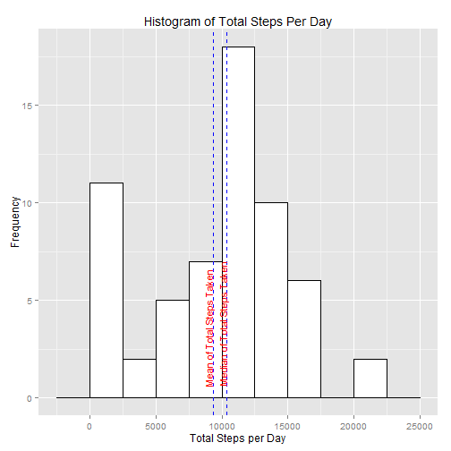
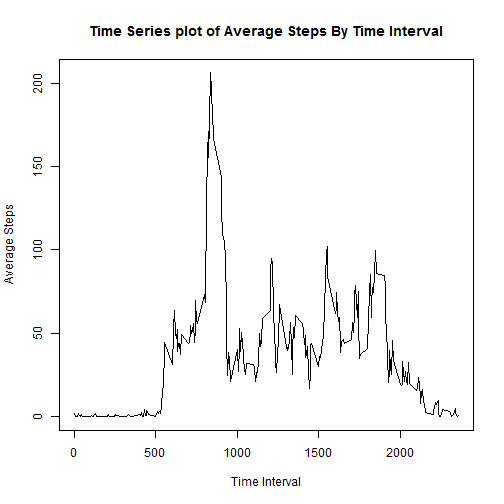
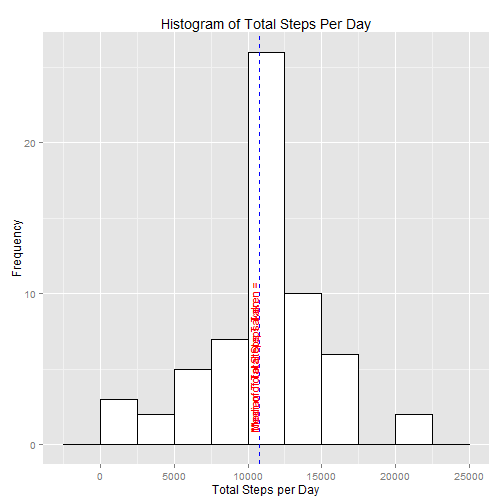
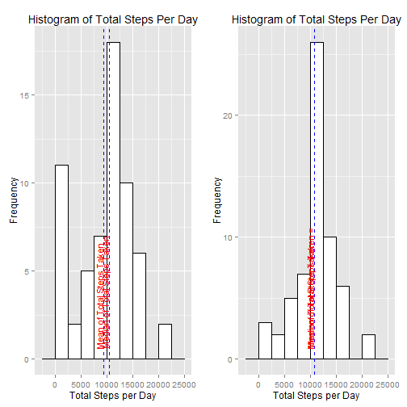
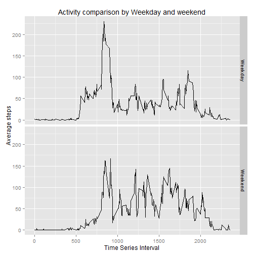

## Loading and preprocessing the data

### Loading the activity File

```r
stepsData <- read.csv("activity.csv",header=TRUE,stringsAsFactors=FALSE)
stepsData$date <- as.Date(stepsData$date,"%Y-%m-%d")

newStepsData <- stepsData
```
### Preprocessing the Data
The data is summarized for everyday activity to generate the histogram.


```r
suppressWarnings(library(plyr))

stepSummary <- ddply(stepsData,.(date),
                    summarize,
  				totalsteps=sum(steps,na.rm=TRUE))
```


## What is mean total number of steps taken per day?

### ggplot is used to draw the required histogram to show the frequency distribution of Total Steps per day.


```r
suppressWarnings(library(ggplot2))

vlineData <- data.frame(measure=c("Mean of Total Steps Taken",
                                   "Median of Total Steps Taken")
                       ,value=c(mean(stepSummary$totalsteps), median(stepSummary$totalsteps)))

first_plot <- ggplot(stepSummary,aes(x=totalsteps)) + 
      geom_histogram(binwidth=2500,color="black", fill="white") + 
    labs(title="Histogram of Total Steps Per Day") + 
	  labs(x="Total Steps per Day") + 
	  labs(y="Frequency") +
	  geom_vline(data=vlineData,mapping=aes(xintercept=value), color="blue", linetype=2) +
	  geom_text(data=vlineData,mapping=aes(x=value, y=0, label=measure), size = 4, angle=90, hjust=-0.1, vjust = -0.1,color="red")

print(first_plot)
```

 

### The mean and median for total steps per day is calculated and stored in data frame for printing.


```r
vlineData
```

                      measure    value
1   Mean of Total Steps Taken  9354.23
2 Median of Total Steps Taken 10395.00
## What is the average daily activity pattern?

### Time Series plot for average number of steps taken across all days in every interval


```r
intervalSummary <- ddply(stepsData,.(interval),
                    summarize,
  				avgsteps=mean(steps,na.rm=TRUE))


plot(intervalSummary$interval, 
            intervalSummary$avgsteps,
            type="l", 
            main="Time Series plot of Average Steps By Time Interval", 
			xlab="Time Interval", 
			ylab="Average Steps")
```

 

### The interval that contains maximum number of steps.


```r
indexOfMaxAvgSteps <- which(intervalSummary$avgsteps == max(intervalSummary$avgsteps))     
intervalSummary[indexOfMaxAvgSteps,1]
```

[1] 835

## Imputing missing values

### Total number of missing values in the dataset


```r
length(which(is.na(stepsData$steps)))
```

[1] 2304

### Strategy for filling missing value in the dataset. I chose to use mean for that 5-minute interval.


```r
naIndices <- which(is.na(stepsData$steps))

for ( ind in naIndices) {
  newStepsData[ind,1] <- intervalSummary[which(intervalSummary$interval == stepsData[ind,3]),2]
}
```

### Histogram of steps taken each day with the missing values filled.


```r
newStepSummary <- ddply(newStepsData,.(date),
                    summarize,
  				totalsteps=sum(steps,na.rm=TRUE))
					

newVlineData <- data.frame(measure=c("Mean of Total Steps Taken", 
                                      "Median of Total Steps Taken = ")
                       ,value=c(mean(newStepSummary$totalsteps), median(newStepSummary$totalsteps)))

second_plot <- ggplot(newStepSummary,aes(x=totalsteps)) + 
      geom_histogram(binwidth=2500,color="black", fill="white") + 
	  labs(title="Histogram of Total Steps Per Day") + 
	  labs(x="Total Steps per Day") + 
	  labs(y="Frequency") +
	  geom_vline(data=newVlineData,mapping=aes(xintercept=value), color="blue", linetype=2) +
	  geom_text(data=newVlineData,mapping=aes(x=value, y=0, label=measure), size = 4, angle=90, hjust=-0.1, vjust = -0.1,color="red")

print(second_plot)
```

 

### Printing the new mean and median. The new mean and median is higher than before. 


```r
newVlineData
```

                         measure    value
1      Mean of Total Steps Taken 10766.19
2 Median of Total Steps Taken =  10766.19

### Comparing the histogram of data with NA values and without NA values.


```r
suppressWarnings(library(grid))
suppressWarnings(library(gridExtra))
grid.arrange(first_plot,second_plot,ncol=2)
```

 

## Are there differences in activity patterns between weekdays and weekends?

### Yes. The weekday activity is more than the weekend activity throughout the day consistently


```r
weekDayData<- cbind(data.frame(dayOfWeek=weekdays(newStepsData$date),dayCat=weekdays(newStepsData$date)))

weekDayData$dayCat <- sub("Monday","Weekday",weekDayData$dayCat,fixed=TRUE)
weekDayData$dayCat <- sub("Tuesday","Weekday",weekDayData$dayCat,fixed=TRUE)
weekDayData$dayCat <- sub("Wednesday","Weekday",weekDayData$dayCat,fixed=TRUE)
weekDayData$dayCat <- sub("Thursday","Weekday",weekDayData$dayCat,fixed=TRUE)
weekDayData$dayCat <- sub("Friday","Weekday",weekDayData$dayCat,fixed=TRUE)
weekDayData$dayCat <- sub("Saturday","Weekend",weekDayData$dayCat,fixed=TRUE)
weekDayData$dayCat <- sub("Sunday","Weekend",weekDayData$dayCat,fixed=TRUE)

newStepFrame <- cbind(newStepsData,weekDayData)


weekdaySummary <- ddply(newStepFrame,.(dayCat,interval),
                    summarize,
  				avgsteps=mean(steps,na.rm=TRUE))

ggplot(data=weekdaySummary, aes(x=interval,y=avgsteps,group=dayCat)) +
        geom_line() +
		facet_grid(dayCat ~ .) +
	    labs(title="Activity comparison by Weekday and weekend") + 
	    labs(x="Time Series Interval") + 
	    labs(y="Average steps")
```

 
